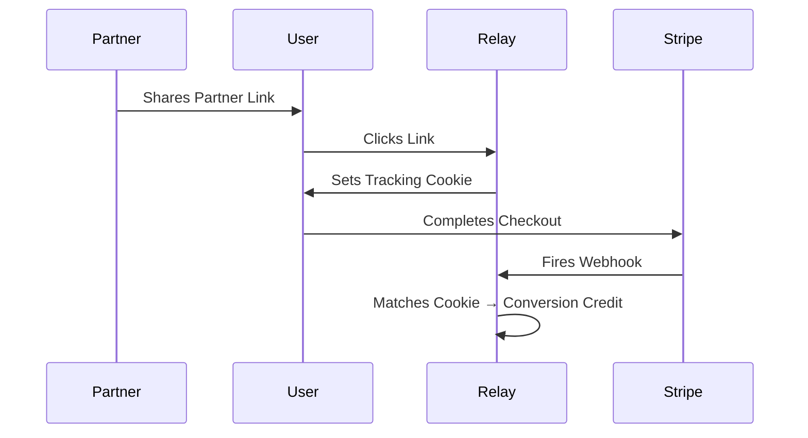

<div align="center">

# ⚡ Relay

**Self-hosted, privacy-first affiliate tracking. No Stripe keys required.**

[](./LICENSE)
[](https://www.typescriptlang.org/)
[](./docker-compose.yml)

</div>

---

## Why Relay?

Rewardful, FirstPromoter, and Refgrow charge $29–$99+/month and demand full read access to your Stripe account. Relay flips the model:

- **Zero Stripe Read Access**: We only listen to webhooks. Your revenue data, customer emails, and transaction history never leave your infrastructure.
- **Self-Hosted & Sovereign**: Deploy on your own hardware. No third-party ever touches your attribution logic.
- **Free for the Community**: No monthly fees. Ever. The community edition is fully featured and free forever under AGPL-3.0.
- **Open-Source Auditable**: Partners and customers can inspect the exact attribution math. Trust through transparency.

## Architecture



## Quick Start

```bash
# Clone the repository
git clone https://github.com/EdgeIQ-Labs/edgeiq-affiliate.git relay
cd relay

# Start everything (API, Web, PostgreSQL)
docker compose up -d

# Visit the admin dashboard
open http://localhost:3000
```

## Features

- **Tracking Engine**: High-performance click and conversion tracking via Hono.
- **Webhook Processing**: Secure Stripe webhook ingestion with signature verification.
- **Admin Dashboard**: React + Vite SPA for managing partners, rules, and payouts.
- **Partner Portal**: Dedicated portal for affiliates to view stats and links.
- **Commission Rules**: Flexible rule engine for flat, percentage, and tiered commissions.
- **Payout Management**: Track and manage partner payouts directly from the dashboard.
- **Zero Stripe SDK Dependency**: Lightweight integration using raw webhook payloads.

## Monetization Tiers

| Tier | Price | License | Details |
|------|-------|---------|---------|
| **Community** | Free | AGPL-3.0 | Full features, self-hosted, open-source. |
| **Pro** | $299 lifetime | Commercial | Closed-source embedding, priority support. |
| **Managed** | $99/mo | Commercial | Fully managed hosting by EdgeIQ Labs. |

*See [LICENSE-COMMERCIAL.md](./LICENSE-COMMERCIAL.md) for commercial licensing details.*

## Tech Stack

- **Backend**: Hono, Drizzle ORM, PostgreSQL, Bun
- **Frontend**: React, Vite, Tailwind CSS
- **Infrastructure**: pnpm monorepo, Docker Compose

## Contributing

We welcome contributions! Please read [CONTRIBUTING.md](./CONTRIBUTING.md) for development setup, testing, and PR guidelines.

## Security

Please do not report security vulnerabilities through public GitHub issues. Instead, email security@edgeiqlabs.com with details so we can coordinate a fix and disclosure timeline.

## Documentation

- [Specification](./docs/SPEC.md) — Full architectural spec.
- [Deployment Guide](./docs/DEPLOY.md) — Production hardening and deployment.
- [Journal](./docs/JOURNAL.md) — Development log and phase breakdowns.

---

<div align="center">
Built by <a href="https://edgeiqlabs.com">EdgeIQ Labs</a>. Licensed under AGPL-3.0-or-later.
</div>
